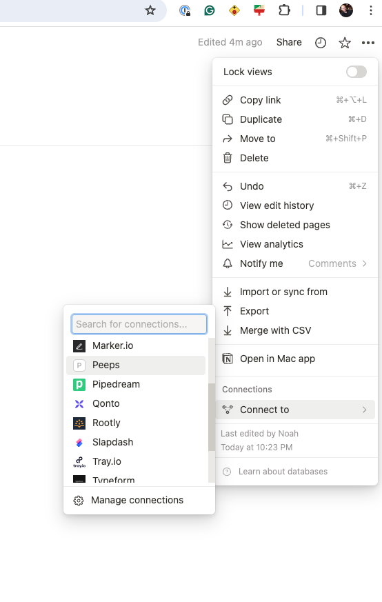

# SETUP

## Integrations

1\. Go here and click on + integrations https://www.notion.so/my-integrations

2\. Grab your secret once you have created your integration.

3\. Add it to a file called .env under NOTION_API_SECRET={YOUR_SECRET}

4\. Connect peeps to your page.

